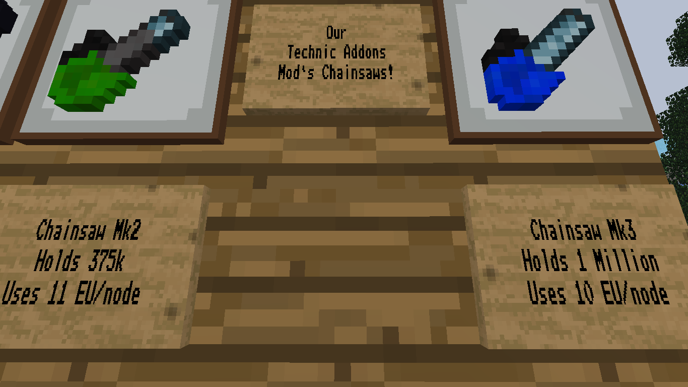
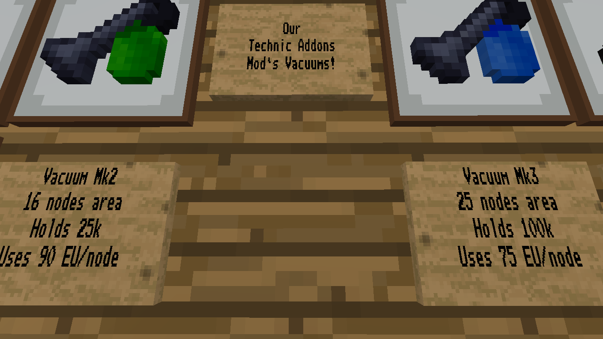
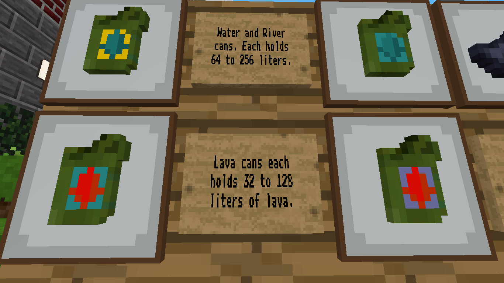

# Technic Addons 
This mod was originally made for the https://playminetest.com server on the request of a player to add MK2 and MK3 chainsaws. However I took it a step up and added a few more additions as well to turn it into a full fledge addon mod! Below are the additions made to the mod... 
 
# Chainsaws

Below are the specs of the additional chainsaws! 
- Chainsaw MK2: Holds 375,000 EU and uses 11 EU/node 
- Chainsaw MK3: Holds 1,000,000 EU and uses 10 EU/node 
 
# Vacuums

Below are the specs of the additional vacuums! 
- Vacuum MK2: 16 Nodes Area and Holds 25,000 EU and uses 90 EU/node 
- Vacuum MK3: 25 Nodes Area and Holds 100,000 EU and uses 75 EU/node 
 
# Cans

Below are the specs of the additional cans! 
- Medium: Holds 32 to 64 liters depending on can type 
- Large: Holds 128 to 256 liters depending on can type

All textures and coding was based off of Technic which it's repository is https://github.com/mt-mods/technic and therefore the unmodified portions of the coding and textures still belongs to the original Technic mod creator(s). 
 
# How to contribute to this mod 
In order to contribute ideas or requests for changes, please create a [New Issue](https://notabug.org/PlayMinetest/TechnicAddons/issues/new) in the [issue tracker](https://notabug.org/PlayMinetest/TechnicAddons/issues). If you can make changes directly, please feel free to fork this repo, commit your improvements with comments, and submit a detailed Pull Request **that was ALREADY tested on a local multiplayer server**. For the additions or changes you would like to propose to us. This is ensure we are able to push your changes as quickly as possible.
